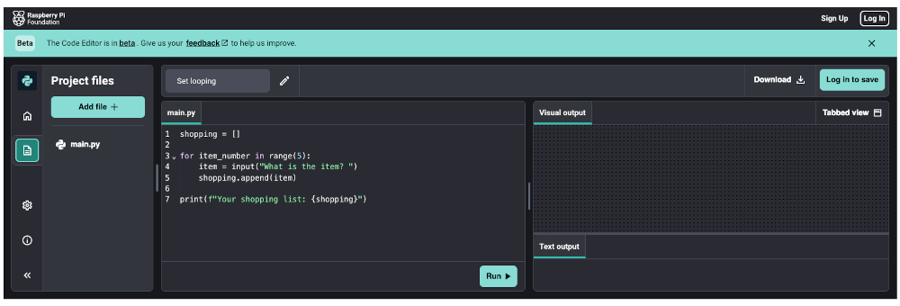
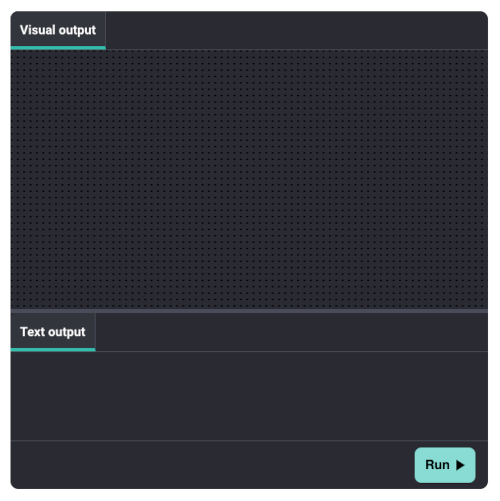
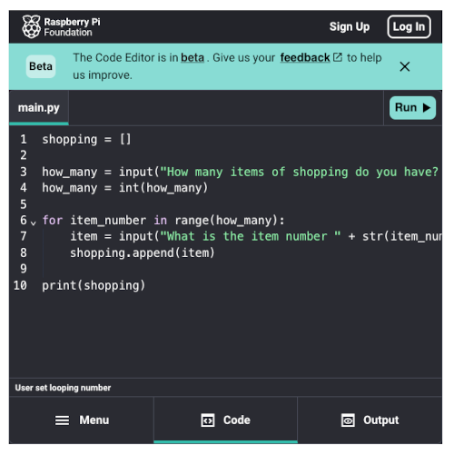

# Code Editor file snippets read me

To create Code Editor projects for your online course there are a number of steps to follow. Code Editor projects should follow the naming convention shown below so that they can be recognised from the Code Editor API and to ensure that the identifiers used for each Code Editor project are unique.

## Naming convention

Each code editor project needs an identifier (more about this later), this needs to be unique across the whole Code Editor ecosystem.

Use the following naming convention when creating your Code Editor project:

__eddev-\<courseid\>-week-step-name__

## Setting up a new Code Editor project

Within your GitHub repository you need to have the following directory structure created (if you cloned the online courses repository template then you will already have this in place):

+ Repository root directory
  + en
    + code

The __'en'__ directory indicates that the code contained within it is in the English locale. If you have code in other locales, then you can create the relevant directory for that locale and the Code Editor will offer the code version that matches the locale of the users browser.

### Sample project

If you cloned the online course repository, then you will have a directory within the __'en\code'__ called __'eddev-template-code'__. This directory has two files inside it:

+ main.py
+ project_config.yml

The details of these two files files are discussed below.

### Create project directory

Inside the 'code' directory, create a new directory and name it with the name created as per the naming convention above.

### Create project files

Inside the directory you just created you will need to create a minimum of two files. The first is a project config file and the second is the code that you would like the Code Editor project to display.

#### Project Config file

The project config file is a YAML file that contains the following lines:

1. __name:__ _'User friendly project name - inside single quotes'_
1. __identifier:__ _'unique project identifier to match directory name - inside single quotes, no spaces; use hyphens between words'_
1. __type:__ _'programming language - for now, python or html - inside single quotes'_
1. __build:__ _true or false - not inside quotes_

By setting the build tag to __false__ you can tell the Code Editor API not to build a project from this directory.

#### Code file(s)

This needs to be a HTML (can include html, css and js files) or Python file. All files within this directory will be loaded into the project.

##### Python files

You should have a __main.py__ file that contains the main program. If you need other files for includes etc. then you can add these and import them into your main.py file.

##### HTML files

<TODO - Add HTML documentation!>

### Uploading the project

As soon as you push the new directory and files to the GitHub repository, the Code Editor API will create the new project for you.

If you push the changes to the 'master' branch the API will create the project in the live Code Editor environment. If you push the changes to a branch named 'draft', the API will create the project in the staging environment. Details on accessing the environments are below.

## Accessing the Code Editor environments

You can access the production and staging environments at the links below. You may need to ask digital to give you access to these first!

+ [Production Environment](https://editor-api.raspberrypi.org/admin/)
+ [Staging Environment](https://staging-editor-api.raspberrypi.org/admin/)

Within the environment you can search by project name to see details of the files included and when they were last synchronised from GitHub

## Embedding a project into an online course

There are a number of different ways in which you can embed Code Editor projects using an iframe. The final part of the URL used in the iframe embed code should be the __identifier__ that you defined in the __project_config.yml__ file.

### Display the full editor

Any width setting greater than 600 pixels in the iframe embed will cause the full editor to display with separate panels for menu, code and output within the iframe

```html
<iframe src="https://editor.raspberrypi.org/en/projects/set-looping" width="100%" height="600" frameborder="0" marginwidth="0" marginheight="0" allowfullscreen=""></iframe>
```



### Display the output only editor

To display an editor that only shows the output of your code (useful if you want users to run the code and see the output, without being able to see the code itself) you change the __/projects__ part of the URL in the iframe to __/embed/viewer__

```html
<iframe src="https://editor.raspberrypi.org/en/embed/viewer/set-looping" width="600" height="600" frameborder="0" marginwidth="0" marginheight="0" allowfullscreen=""></iframe>
```



### Display the tabbed view of the editor

To include tabs for menu, code and output within your embedded code editor use the following iframe code:

```html
<iframe src="https://editor.raspberrypi.org/en/projects/set-looping" width="600" height="600" frameborder="0" marginwidth="0" marginheight="0" allowfullscreen=""></iframe>
```



## Points to note

1. It is entirely possible for a Code Editor project to be defined in GitHub with the same name. It appears that the API will currently just process the first project it comes across. This is the reason for establishing our naming convention!
1. You can delete a Code Editor project from GitHub, and if it has already been built it will remain in the respective Code Editor environment. If you are removing projects from GitHub you should also delete them from the environment.
